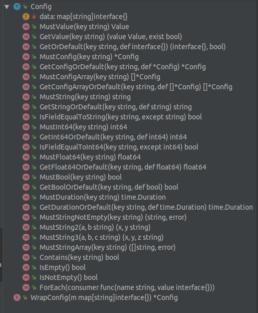

# Util for config

此工具包主要是提供一个JSONMap格式的Config对象，并提供一些数据类型转换接口。

经常使用它来读取Toml配置文件，将其结果转换成 Config 对象。

## Install

```bash
go get -u github.com/parkingwang/go-conf
```

OR

```bash
dep ensure -add github.com/parkingwang/go-conf
```

## Usage

### Map对象

cfg.Config 包装`map[string]interface{}`，提供一个不可变访问接口，通过 GetXXX, MustXXX 等函数来读取内部数据。

详细见 **MustXX** 函数和 **GetXXOrDefault** 函数。



### LoadConfig 加载TOML配置文件

**支持 TOML-v4 语法**

- *LoadConfig* 加载指定配置文件夹名称或者TOML文件路径，返回全部配置文件的Map对象；
- *LoadDirConfigText* 加载指定TOML配置文件目录，返回所有配置文件的合并Text文本； 
